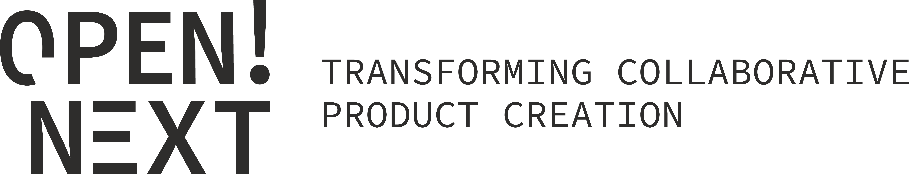

!!!THIS IS ONLY FOR TESTING!!!

## Who we are

Open!Next is a European research project funded by the H2020 Programme of the EU comisison (ID 869984). More info at https://opennext.eu.

## What we do

*We are trying to create the internet of product creation.* Product creation is inaccessible to most citizens today. They have learned to accept problems such as over-engineering, redundant functions and features, or planned obsolescence as a given; and that institutions rather than individuals are in control of technical knowledge. However, the power that comes from technical knowledge is currently being radically redistributed through digital transformation. OPEN!NEXT is an attempt to transform how products are created, making it more accessible to work in an open source fashion for the benefits of citizens and businesses alike.

## About this repository

This is the public pace in which partners of the project share files and information. This project is about Open Source Hardware, and we want to make it the open source way! We adopt an open science policy aiming at transparency (public visibility of project advancement), participation (ability for any interested individual to engage in the project) and reusability of knowledge (use of non-exclusive intellectual property schemes).

## User guide

Task management within "Projects" is used as follows:
  1. add note and convert to issue (title and if needed description)
  2. assign issue to at least one person (person may need to register first...)
  3. assign label - low, medium, high priority
  4. move to correct column - backlog, todo, etc.
  5. if needed, set milestone
  6. use description field for #updates, #details, or #requirements in that order
